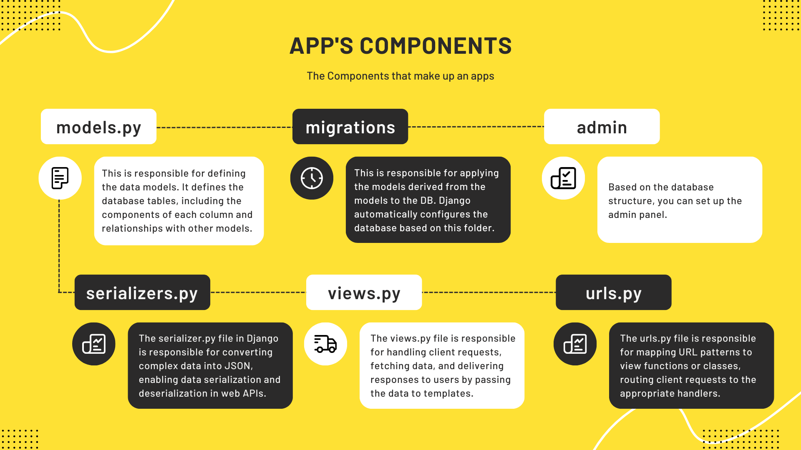
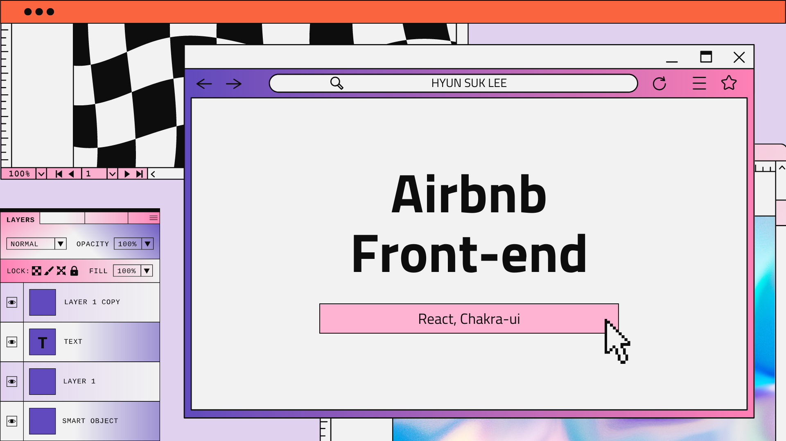

This is Full-stack coding. Building Airbnb service with Django and React. It covers the backend and frontend components, including app functionalities and their interaction.

 
 

 

# **<Text style="color:#EC6664"> Airbnb Clone Coding</Text>**

#### <Text style="color:#EC6664"> Using Language and tools : </Text> Django(Python), Rest API, React, Poetry, Git

 

#### <Text style="color:#EC6664"> Goal of this project : </Text>

The project aims to gain a thorough understanding of implementing a practical service and carefully constructing data for analysis, starting from the service planning phase. It emphasizes the integration of developed models into real services and the exploration of business considerations, going beyond data manipulation.

 

 

## **<Text style="color:#EC6664"> Backend</Text>**

For developing Airbnb backend, I used Django server on the Poetry environment. I choose the Poetry for library management. Poetry is a powerful dependency management tool. I can install the library and framework into the project as package.

 
Django is the python based web framework. it is easy to develop and maintain the database. The charming point is that I don't need to develop the admin page. This framework provide the admin page without any developer's effort. And this is the python based framework. So it is easy to develop and widely used.

 

### **<Text style="color:#EC6664"> Basic concepts of Django</Text>**

 

 
Django's app: A Django app is a modular component that encapsulates a specific functionality within a Django project. It consists of models.py (defines the data structure), migrations (manages database schema changes), admin (provides an interface for managing app data), serializers.py (converts data to different formats like JSON), views.py (handles HTTP requests and returns responses), and urls.py (maps URLs to corresponding views). Here is the important files of app.

**<Text style="color:#EC6664"> models.py:</Text>** It defines the data structure for the app by creating Python classes that represent database tables. Each class typically corresponds to a table, and its attributes define the table's fields and relationships with other tables.

**<Text style="color:#EC6664"> migrations:</Text>** Migrations are files generated by Django to manage changes to the database schema. They allow you to easily apply and revert changes to the database structure as you modify your models.py file.

**<Text style="color:#EC6664"> admin:</Text>** The admin module provides a user-friendly interface for managing app data. It allows you to perform CRUD operations (Create, Read, Update, Delete) on the app's models through a web-based administrative interface.

**<Text style="color:#EC6664"> serializers.py:</Text>** Serializers convert complex data types, like models, into a format that can be easily rendered into JSON or other content types. They facilitate the transfer of data between the app and external systems.

**<Text style="color:#EC6664"> views.py:</Text>** Views handle HTTP requests and return responses. They contain the logic to process user input, retrieve data from the database using models, and render templates or return data in various formats.

**<Text style="color:#EC6664"> urls.py:</Text>** The URLs module maps URLs to their corresponding views. It defines the URL patterns for the app, allowing it to respond to specific URL patterns with the appropriate view or action.

 

### **<Text style="color:#EC6664"> Structure of backend</Text>**

 

 
There are 11 apps in Airbnb. Let me introduce each app in the order of user's actions.

The first step is called Config, which serves as the foundation of the entire application development process. The Config app contains settings and parameters that define the behavior of the entire system.

The second step is Common, which acts as the fundamental model for the other apps. This Common app serves as an interface for the other apps and provides a base model that they can build upon.

Through this architecture, the other apps in Airbnb interact with the Common app and create their own separate models to fulfill their specific functionalities.

The third step involves Users. This app manages the information of registered users, hosts, and administrators. The next step is Categories. We have two types of products: rooms and experiences. Hosts can upload information about either rooms or experiences. Before creating the Rooms and Experiences apps, I established a framework for these two types of rental products.

The Rooms app and Experiences app contain the definitions of the room and experience content each. Alongside the Medias app, hosts can upload pictures and videos of their rooms and experiences. For Uploading media, I picked [CloudFlare](https://www.cloudflare.com/) service to hosting photos and videos. My service will save the link of the medias through the Couldflare.

The Wishlists app assists users in saving their preferred products, while the Direct Messages app allows users to send messages to hosts. The Bookings app enables users to make reservations. After using our services, users can leave product reviews using the Reviews app.

This represents the entire backend of Airbnb I made, which is developed using Django.

 

## **<Text style="color:#EC6664"> Front end of Airbnb</Text>**

 

 

 

For the front-end of Airbnb, I utilized React in conjunction with Chakra-UI. The front-end communicates with the back-end via the REST API.

The schema outlines the structure of the links. There are three independent links: 'notfound', 'manage-booking', and 'mybookings'. And two links contain the other links. The 'social' link is used for logging in through the APIs of social network services such as KakaoTalk and GitHub.

The 'rooms' link displays product information to users and hosts, and hosts can also upload and modify information about their products through this link.

Hosts and users each have different access rights to services. Hosts have the authority to modify the rooms and experiences they offer and can upload new locations. However, users have the authority to make bookings and add rooms to their wishlist. On the root page, these functions are implemented through different buttons for each user. For users, a heart-shaped wishlist is displayed, and if they are a host, they are shown a modify button and an upload photo button for their rooms.

 

 

## **<Text style="color:#EC6664"> Screen shots of Airbnb</Text>**

 

[Airbnb Clone Coding GitHub Repository Link](https://github.com/Nockda/Airbnb_clone.git)
