Understanding Model Performance and Feature Interpretation using Captum

#### Using language and Tools

Python, Numpy, Pandas, PyTorch, SKlearn, Ray Tune, Captum, Matplotlib

## <Text style="color:#008080">Goal of this project</Text>

Train two deep neural network which can take images with a cell nuclei and classify it into one of the following types which are shown in the figures above:

| Label | Description                   |
| :---- | :---------------------------- |
| 0     | Normal epithelial cell nuclei |
| 1     | Cancer epithelial cell nuclei |
| 2     | Muscle cell nuclei            |
| 3     | Immune leukocyte cell nuclei  |

 

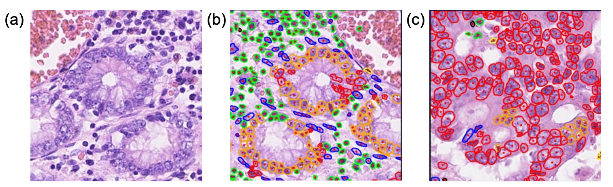

(a) Normal Colon Tissue.

(b) <Text style="color:orange">Orange</Text> = normal / <Text style="color:red">Red</Text> = cancer / <Text style="color:green">Green</Text> = immune cells / <Text style="color:blue">Blue</Text> = connective tissue.

(c) Cancer sample.

 

### <Text style="color:#008080">Methodology</Text>

I employed two models in my study:

1. Personalized ConvNet: I utilized <u>Ray Tune</u> for hyperparameter tuning and experiment management to optimize its performance. The model provided _Loss and Accuracy curves_, _a Confusion Matrix_, and Model Interpretation as output.
2. Pretrained ConvNet: For this model, I leveraged a pretrained Convolutional Neural Network. Similarly, I utilized <u>Ray Tune</u> to fine-tune the hyperparameters and manage the experiments. The model also generated _Loss and Accuracy curves_, a _Confusion Matrix_, and Model Interpretation.

   **Ray Tune** played a crucial role in efficiently managing the hyperparameter tuning process and experiment tracking for both models.

 

### <Text style="color:#008080">Dataset Description</Text>

#### **File descriptions**

| File        | Contents                                                                             |
| :---------- | :----------------------------------------------------------------------------------- |
| train.zip   | zip file containing the training images                                              |
| test.zip    | zip file containing the test images                                                  |
| train.csv   | csv file containing the training image filenams and ground truth labels (0, 1, 2, 3) |
| example.csv | an example submission file in the correct format                                     |

 

**Data fields**

| Label    | Description                                         |
| :------- | :-------------------------------------------------- |
| Filename | filename of an image file                           |
| Label    | the type of cell nucleus at the middle of the image |

 

## <Text style="color:#008080"> Personalized ConvNet Conclusion</Text>

- Confusion Matrix and Accuracy Curve of personalized ConvNet

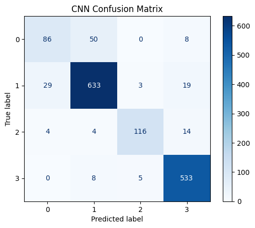

 

- Accuracy Curve and Loss curve

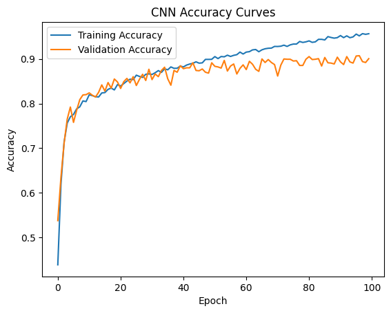
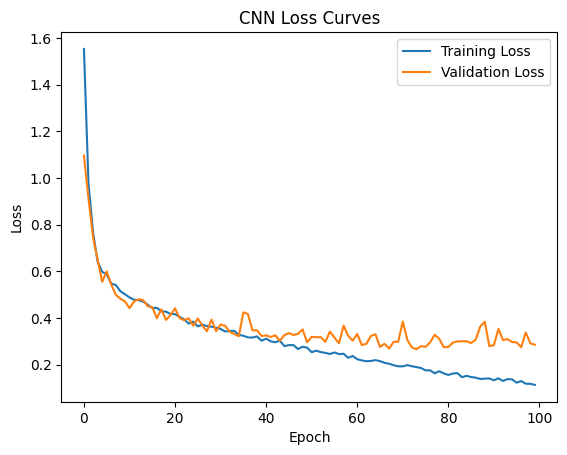

- Gaussian Noise, Gradients and Occlusion (using Captum)

  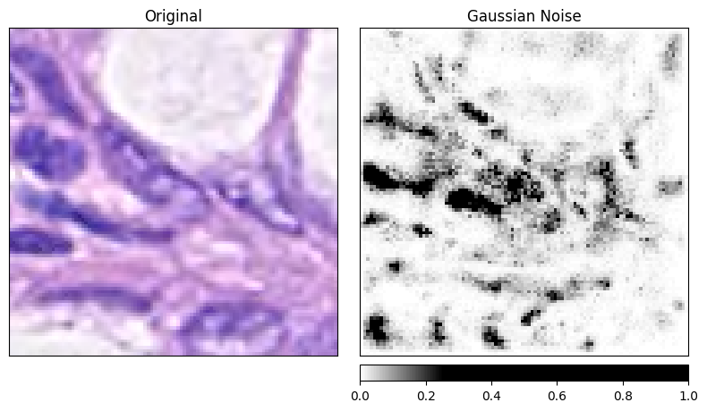

  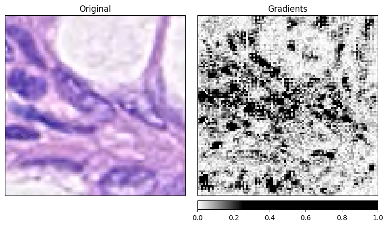

  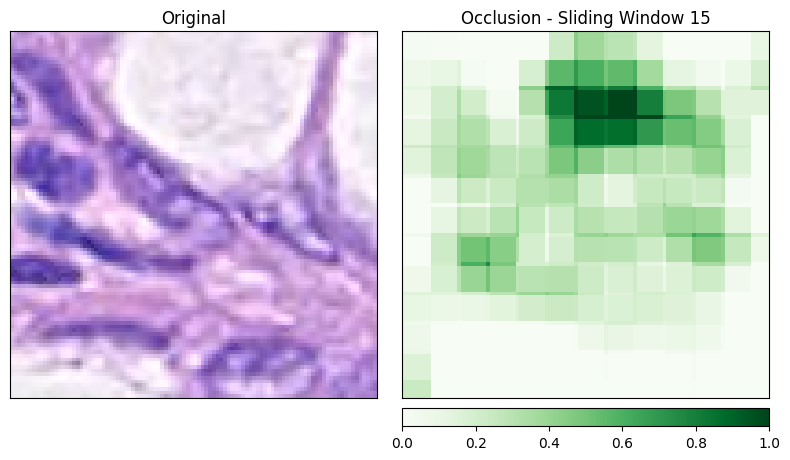

 

## <Text style="color:#008080"> Pretrained ResNet50 Conclusion</Text>

- Confusion Matrix and Accuracy Curve of ResNet50

  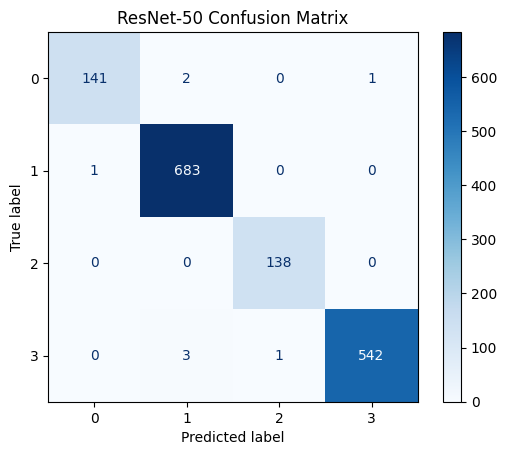

 

- Accuracy Curve and Loss curve

  
  

- Gaussian Noise, Gradients and Occlusion (using Captum)

  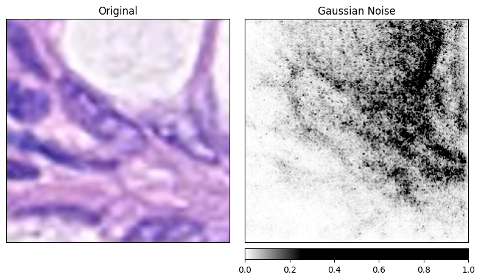

  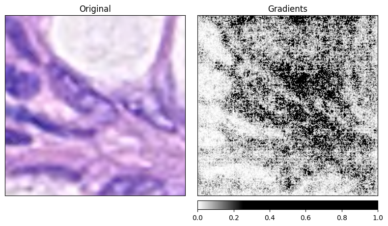

  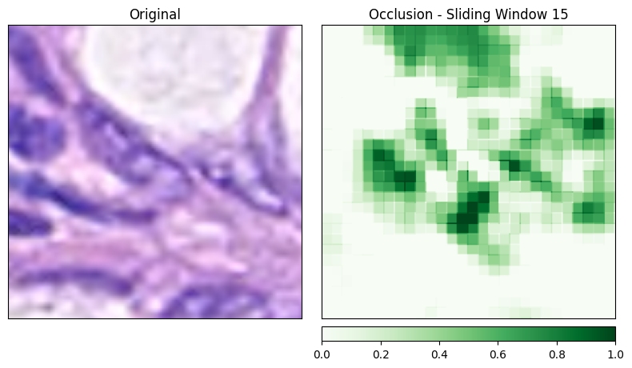

 

## <Text style="color:#008080"> Conclusion</Text>

The final accuracy was 96 percent. Although there were concerns about overfitting during the validation, fortunately, the results turned out well. Using the Captum library, I was able to examine how the results were predicted and which data was used for the predictions. In terms of the difference between the Personalized model and the Pretrained model, the performance of the Pretrained model was significantly better. The reason for this is that the Personalized model only used 8 layers, while the Pretrained model utilized ResNet50, which has 50 layers, allowing it to capture a greater number of features and demonstrate better performance.
