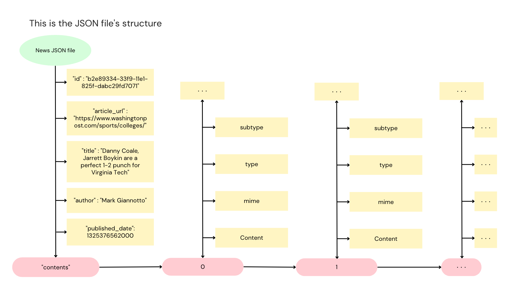
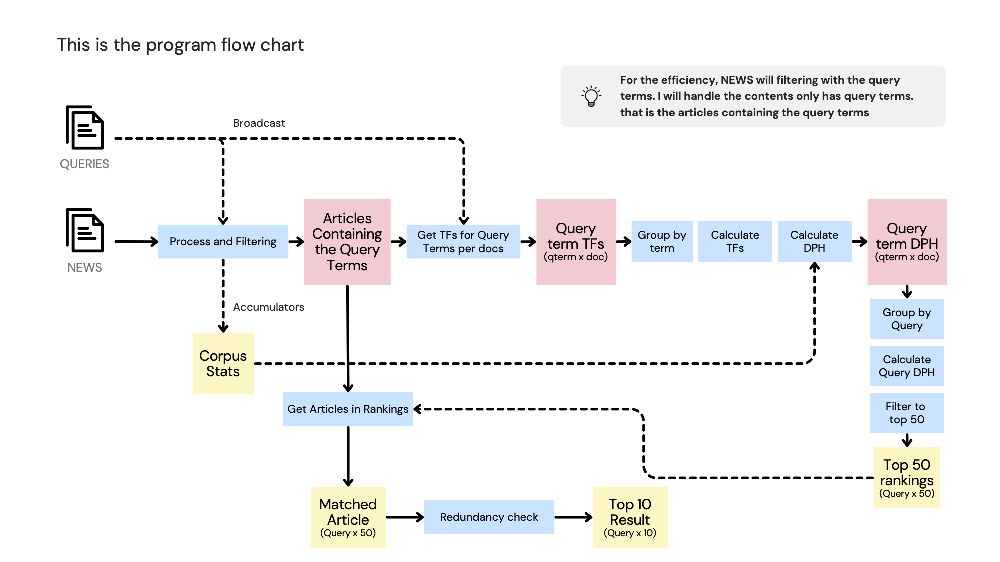

Focuses on designing, implementing, and testing a complex Spark application for Big Data analysis. Evaluations will be based on functionality, code quality, efficiency.

## <Text style="color:#E84CF5">Goal of this project</Text>

This project is to design and implement a batch-based text search and filtering pipeline with Java Spark.
The pipeline will do these work below.

1. Process each document and query by removing stopwords and applying stemming.
2. Rank the text documents for each query based on their relevance. This involves calculating the DPH score, which takes into account various factors such as term frequency, document length, average document length, and total number of documents.
3. Apply filtering to remove overly similar documents in the final ranking.
4. Return the top 10 documents for each query as the final output.

 

## <Text style="color:#E84CF5"> The given JSON data containing News </Text>

The dataset used for this project consists of news articles from the Washington Post and a set of queries. There are two versions of the dataset: a sample version with 5,000 news articles and three queries, and a full dataset with around 670,000 documents. Each query includes the original query, tokenized query terms, and the count of each query term. The sample version is for develop and test the program, and the full dataset is for evaluation.

A news article contains fields such as ID, article URL, title, author, publication date, contents, type, and source. For this project, only the 'id', 'title', and 'contents' fields are relevant. The 'contents' field contains various elements within the article, including the kicker line, title element, header image, and paragraphs. When calculating DPH (Document Positional Hashing) for a document, only consider terms within the title and paragraphs marked with a non-null subtype as "paragraph". If an article has more than 5 paragraphs, consider only the first 5. The provided code does not apply any text pre-processing to the news articles, so you may need to handle missing or null fields in the data when implementing your code.

 

## <Text style="color:#E84CF5"> Process </Text>

In this project, the goal is to develop a batch-based text search and filtering pipeline using Apache Spark. The pipeline involves processing a large set of text documents and a set of user-defined queries to rank the documents by relevance for each query and filter out overly similar documents.

Here are the key steps involved in implementing the pipeline:

1. Load the query set and convert it into a Dataset<Query>.
2. Load the news articles and convert them into a Dataset<NewsArticle>.
3. Implement a text pre-processor function to tokenize the text, remove stopwords, and perform stemming.
4. Filtering article without the query terms.
5. Implement a DPH scoring function to calculate the relevance score for each <document, term> pair. Consider factors such as term frequency, document length, average document length in the corpus, total number of documents, and sum of term frequencies across all documents.
6. Calculate the DPH score for each <document, query> pair by averaging the DPH scores for each <document, term> pair in the query.
7. Rank the text documents for each query based on their relevance scores.
8. Apply a filtering mechanism to remove overly similar documents in the final ranking. Compare the textual distance between document titles using a provided function.
9. Remove redundant documents with a textual distance less than 0.5, keeping the most relevant one based on the DPH score.
10. Return the top 10 documents for each query as the final output.

Throughout the implementation, utilize Spark transformations and actions to efficiently process the data. It is important to avoid offline computations and ensure that all processing occurs within the lifecycle of the Spark application.

By following these steps, I will be able to develop a powerful text search and filtering pipeline using Apache Spark, enabling efficient retrieval of relevant documents for user-defined queries.

## <Text style="color:#E84CF5"> Conclusion</Text>

This project presents an exciting opportunity to leverage Apache Spark for designing and implementing a powerful text search and filtering pipeline. By working on this project, I can gain valuable experience in handling big data, processing text documents, and performing advanced analytics tasks.

The utilization of Apache Spark provides a scalable and distributed computing framework, enabling efficient processing of large datasets. Leveraging Spark transformations and actions, I can optimize the performance of the pipeline and ensure real-time processing of data, without the need for offline computations.

By following the outlined steps and best practices, I can contribute to the development of an effective search and filtering pipeline. The evaluation of functionality, code quality, and efficiency allows for iterative improvements and fine-tuning, ensuring the pipeline's reliability and robustness.

Overall, this project offers me an opportunity to sharpen their skills in data processing, text analysis, and machine learning techniques. The insights gained from this project can be valuable in various domains, including information retrieval, recommendation systems, and data-driven decision making.
