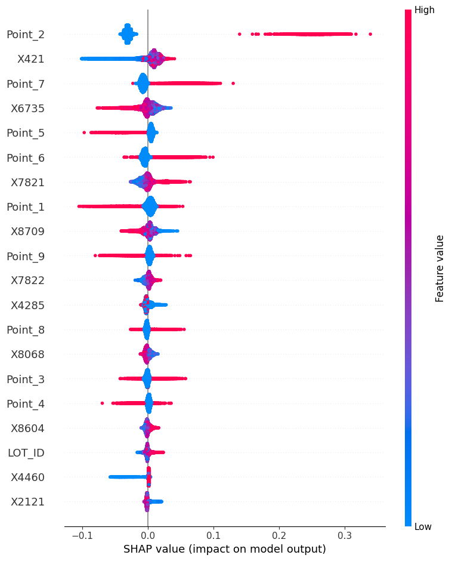

#### Using language and Tools

Python, xgboost, lightbgm, matplotlib, joblib, pandas, sklearn

 
 

## <Text style="color:#50B1E4">Goal of this project</Text>

 

There are 8 main steps involved in the manufacturing of memory semiconductors. Among these processes, the Photo and Etching process stands out as the most crucial. When it comes to quality control, it is essential for the manufacturer to carefully analyze the factors that could potentially contribute to defects.

Identifying the critical factor causing defects in the initial two steps is crucial in order to prevent additional costs associated with defective production. However, the small size of semiconductor products makes it challenging to inspect every single one, resulting in increased difficulty and expense for quality control (QC) efforts. Instead of inspecting each individual product, a more practical approach is to select representative samples and forecast the overall quality of an entire wafer.

The dataset available for analysis contains inspection results, which are represented by numerical values. These numbers indicate the height and size of the circuits etched onto the semiconductor as a result of the photo and etching processes.

In this project, the sensors of each equipment will send their values to the Manufacturing Execution System (MES). However, due to the massive amount of data generated in this process, it is necessary to preprocess the numbers before uploading them to the MES. Once the preprocessing is complete, the MES will upload the results to the cloud. The data will then be reflected in the Analysis Environment, where models and algorithms are utilized for further analysis.

Ultimately, the results obtained from these models will be generated, and feedback will be collected to update and improve the existing models. This iterative process allows for continuous refinement and enhancement of the overall working process in the project.

 

## <Text style="color:#50B1E4"> The dataset </Text>

 

## <Text style="color:#50B1E4"> Data Rediness Check </Text>

1.  Data Missing Check

        col = []
        missing = []
        for name in data.columns:

            # Missing
            missper = data[name].isnull().sum() / data.shape[0]
            missing.append(round(missper, 4))

2.  Data Unique Check

        col = []
        level = []
        for name in data.columns:

            # Leveling
            lel = data[name].dropna()
            level.append(len(list(set(lel))))

            # Columns
            col.append(name)

3.  Cutting the data

        # Make a dataframe with missing data

        summary = pd.concat([pd.DataFrame(col, columns=['name']),
                            pd.DataFrame(missing, columns=['Missing Percentage']),
                            pd.DataFrame(level, columns=['Unique'])], axis=1)

        # Data Cutting
        drop_col = summary['name'][(summary['Unique'] <= 1) | (summary['Missing Percentage'] >= 0.8)]
        data.drop(columns=drop_col, inplace=True)
        print(">>>> Data Shape : {}".format(data.shape))

After the data preprocessing, the shape changes from (1650, 9880) to (1650, 7948).

Prior to proceeding with the modeling process, it is important to observe the dataset's trend since it is a time series data. This is crucial because time series data exhibits temporal characteristics.

I can see the trend of the dataset with code below

    # Y Plot
    for i in range(1,10):
        plt.figure(figsize=(15,5))
        plt.plot(data['LOT_ID'], data['Y{}'.format(i)], c='black')
        plt.plot([0, data.shape[0]], [np.percentile(data['Y{}'.format(i)], 25), np.percentile(data['Y{}'.format(i)], 25)],c='red')
        plt.plot([0, data.shape[0]], [np.percentile(data['Y{}'.format(i)], 75), np.percentile(data['Y{}'.format(i)], 75)],c='blue')
        plt.title('Y{}'.format(i))
        plt.show()

In this plot, it illustrates the trend of the data. The red line represents the lower 25% and the blue line represents the upper 25%.

Except for Y2, all the other Y variables exhibit a distinctive wave pattern at wafer numbers 750-1000. As a data scientist, it is important for me to discuss this specific point with the person in charge. This particular section of the process seems to involve some action or variation that is influencing the observed wave pattern.

 

## <Text style="color:#50B1E4"> Feature Engineering</Text>

In the dataset, columns are more than rows. This will be the problem when we analysis. This feagure incur the curse of dimensionality.

The curse of dimensionality refers to the phenomenon where the performance of certain algorithms or models deteriorates as the number of features or dimensions in the data increases. As the dimensionality grows, the data becomes increasingly sparse, making it difficult for algorithms to effectively generalize or identify meaningful patterns. One of the main challenges of high-dimensional data is the exponential increase in the volume of the sample space.

To begin the analysis, it is necessary to transform the data structure as follows:

Initially, the data consists of 9 points in a wafer with sensor outputs in a single row. This should be transformed into 1 row per a point in a wafer with its corresponding sensor outputs.

Additionally, the columns for EQ and Y(wafer) contain categorical data, not float data. Therefore, these columns need to undergo one-hot encoding. After applying this transformation, the final shape of the data is as follows: 14850 rows by 2115 columns.

By obtaining this final result, the curse of dimensionality is mitigated.

 

## <Text style="color:#50B1E4"> Model Evaluation and Interpretation </Text>

The best result model is

LGBMRegressor

- max_depth=36
- n_estimators=500
- reg_alpha=0.1
- Train Mean squared error: 0.0013
- Train R2 score: 0.9567
- Test Mean squared error: 0.0057
- Test R2 score: 0.7999

Parameter Tuning - Reference : https://lightgbm.readthedocs.io/en/latest/pythonapi/lightgbm.LGBMClassifier.html

Here are the important features of this model: Point_1, X421, Point_9, Point_2, and Point_6. These points are crucial and require attention from the manufacturer. However, the reasons behind these observations are not clear from this chart alone. To gain further insights, I have created an additional plot.

Please provide the details or share the new plot for further analysis and interpretation.

- Based on the plot, it is evident that at Point_2 of all wafers, there is excessive cutting during the etching process. It is crucial for the manufacturer to investigate and address this issue. Additionally, it is worth noting that there is a significant variance associated with this particular point.

- The sensor value X421 exhibits a time-series pattern. At the beginning of the manufacturing process, the etching for X421 is under-processed. However, as time progresses, the etching becomes over-processed for X421.

- Similar to Point_2, Point_7 also experiences excessive cutting during the etching process. The variance associated with this point is also significant. It is important for the manufacturer to examine and rectify the over-cutting issue at Point_7 as well.

 

## <Text style="color:#50B1E4"> Conclusion</Text>

This project provided a great opportunity to analyze real sensor values and etching data in memory semiconductor manufacturing. By examining these datasets, valuable insights were gained, allowing for better understanding of the production process. This analysis opens up possibilities for further improvements in quality control and optimization of the etching process.

This project also provided an opportunity to explore techniques for mitigating the curse of dimensionality through data processing. By transforming the data structure and applying feature engineering, the impact of high dimensionality was addressed. Additionally, interpreting plots and analyzing patterns in the data allowed for valuable insights into the manufacturing process. This experience enhanced my understanding of dimensionality reduction and data visualization techniques, which can be valuable in future data science projects.
