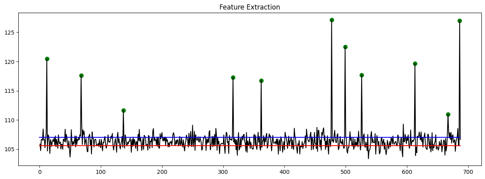

#### Using language and Tools

Python, TensorFlow,

 
 

## <Text style="color:#4C35BD">Goal of this project</Text>

 

Fraud detection in financial transactions is of utmost importance worldwide. The main objective of this project is to develop a model that can identify outliers in financial transactions. By implementing this model, financial companies can effectively prevent fraud, thereby enhancing their brand image.

Financial transaction data typically consists of multiple variables for each transaction. The goal of this model is to predict outliers based on several variables, even in cases where the data does not include specific labels.

Once the model is implemented, its performance can be evaluated based on the total amount of protected money detected. This evaluation can provide valuable insights for marketing purposes.

 

## <Text style="color:#4C35BD"> The characteristic of this project </Text>

In order to achieve real-time fraud detection, a distributed system capable of processing large volumes of data is required. Popular processing tools such as Kafka and InfluxDB are commonly used for this purpose.

However, it's important to note that in this particular project, the main focus is on developing a model for predicting fraud rather than emphasizing the massive data processing aspect.

 

## <Text style="color:#4C35BD"> The dataset </Text>

 

## <Text style="color:#4C35BD"> Data Rediness Check </Text>

1.  Data Missing Check

    This dataset is checked the missing data.
    But this data has no missing data.

2.  Data Unique Check

        col = []
        level = []
        for name in data.columns:

            # Leveling
            lel = data[name].dropna()
            level.append(len(list(set(lel))))

            # Columns
            col.append(name)

3.  Check the Missing and Unique data.

        summary = pd.concat([pd.DataFrame(col, columns=['name']),
                        pd.DataFrame(missing, columns=['Missing Percentage']),
                        pd.DataFrame(level, columns=['Unique'])], axis=1)

| index | Name | Missnig Percentage | Unique |
| :---- | :--- | :----------------- | :----- |
| 0     | Time | 0.0                | 687    |
| 1     | Y1   | 0.0                | 273    |
| 2     | Y2   | 0.0                | 259    |
| 3     | Y3   | 0.0                | 266    |
| 4     | Y4   | 0.0                | 250    |
| 5     | Labe | 0.0                | 2      |

This dataset contains chronological time information ("Time"), four financial transaction variables ("Y1" to "Y4"), and a label indicating whether the data is normal or fraudulent ("Label"). The label value of 0 corresponds to normal data, while a label value of 1 corresponds to fraudulent data. It is important to note that the label values in this dataset were manually assigned by humans and do not exist in real-world data.

Here are the plots that provide an overview of the data. The y-axis represents the timeline, while the x-axis represents the corresponding values. Upon observation, it is evident that certain data points exhibit exceptionally high or low values. These points indicate instances of fraud, which have been identified and marked with green circles.

 

## <Text style="color:#4C35BD"> Feature Extraction Using AutoEncoder</Text>

There are 4 features from Y1 to Y4. This features should be transformed with one value.

First split the dataset as 7:3

        train_idx = list(range(int(data.shape[0]*0.7)))
        valid_idx = list(range(int(data.shape[0]*0.7), data.shape[0]))
        x_train = data.iloc[train_idx,1:-1]
        x_valid = data.iloc[valid_idx,1:-1]

And run the AutoEncoder model

        # This is the dimension of the latent space (encoding space)
        latent_dim = 1

        # input size is four
        data_shape = x_train.shape[1]

        encoder = Sequential([
        Input(shape=data_shape),
        Dense(2, activation='relu'),
        Dense(latent_dim, name='encoder_output')])

        decoder = Sequential([
        Dense(2, activation='relu', input_shape=(latent_dim,)),
        Dense(data_shape)])

        autoencoder = Model(inputs=encoder.input, outputs=decoder(encoder.output))

this is the Summary of AutoEncoder model

        Model: "model_21"
        _________________________________________________________________
        Layer (type)                Output Shape              Param #
        =================================================================
        input_22 (InputLayer)       [(None, 4)]               0

        dense_60 (Dense)            (None, 2)                 10

        encoder_output (Dense)      (None, 1)                 3

        sequential_41 (Sequential)  (None, 4)                 16

        =================================================================
        Total params: 29 (116.00 Byte)
        Trainable params: 29 (116.00 Byte)
        Non-trainable params: 0 (0.00 Byte)

---

And run the model with optimizer adam.

        autoencoder.compile(loss='mean_squared_error', optimizer='adam')
        autoencoder.fit(x_train, x_train, epochs=100, verbose=1)

The output of the AutoEncoder's feature extraction step reveals the presence of 11 fraudulent data points.

 

## <Text style="color:#4C35BD"> Model(LOF and IF) Evaluation and Interpretation </Text>

 

## Local Outlier Factor(LOF) model

Setup the LOF model.
Data's

        LOF = LocalOutlierFactor(n_neighbors=5)
        y_pred = LOF.fit_predict(data.iloc[:, 1:-2])

Data's 2 column has label and the result of autoencoder. So use the data except these two columns.
This model will predict based on 5 neighbors.

        for i in range(y_pred.shape[0]):
        if y_pred[i] == 1:
                y_pred[i] = 0
        else:
                y_pred[i] = 1

        X_scores = LOF.negative_outlier_factor_
        radius = (X_scores.max() - X_scores) / (X_scores.max() - X_scores.min())
        data['lof_score']=radius

The normal label for the autoencoder is assigned as 0, while the fraudulent label is assigned as 1. I modified the label of the LOF's y_pred to match the autoencoder's labels. Subsequently, I put these normalized values into the data.

Here is the output example.

A line plot of the "LOF Anomaly Score" is shown in red, indicating the variation of the anomaly score based on the 'Time' variable. Additionally, scatter points in blue are plotted to represent data points with an anomaly score exceeding a threshold of 0.18.
A line plot of the variable 'Y2' is displayed, illustrating the change in 'Y2' values over time. Scatter points in green are marked to represent instances where the label (Label) is equal to 1, indicating anomalies.
The plot includes axis labels, axis tick settings, and grid lines. The left Y-axis is labeled as "Anomaly Score" in red, and the right Y-axis is labeled as "Y2" in blue. The plot is titled "Score vs Y2" and has appropriate font sizes and spacing.

 

## Isolation Forest (IF) model

Set up the IF model and rescale the value.

        # Isolation Forest Setup
        IF = IsolationForest(n_estimators = 50, max_samples = 600)
        IF.fit(data[['Y1', 'Y2', 'Y3', 'Y4']])
        y_pred = IF.predict(data[['Y1', 'Y2', 'Y3', 'Y4']])

        # rescale the value
        for i in range(y_pred.shape[0]):
        if y_pred[i] == 1:
                y_pred[i] = 0
        else:
                y_pred[i] = 1
        X_scores = IF.score_samples(data[['Y1', 'Y2', 'Y3', 'Y4']])

        # normalize the value and save it
        radius = (X_scores.max() - X_scores) / (X_scores.max() - X_scores.min())
        data['IF'] = y_pred
        data['IF_score'] = radius

All the process is same as LOF model.
Here is the output of the IF model. The prediction accuracy is better than LOF model. But the deviation of the predict value is higher than the others

 

## <Text style="color:#4C35BD"> Conclusion</Text>

This graph presents the output results of each model. The yellow points correspond to the original labels of the dataset. Among the models, the IF (Isolation Forest) model demonstrates the strongest predictive power. However, it also exhibits a high deviation. The LOF (Local Outlier Factor) model, on the other hand, may not have a significantly high accuracy, but it exhibits a higher precision compared to the other models.

I can create an ensemble model using these models for a real-world service. In such a service, labeled data may not be available, but it is essential to predict fraud. This approach will be valuable in providing insights on how to develop a Fraud Detection System (FDS) and enhance my understanding of the process.
