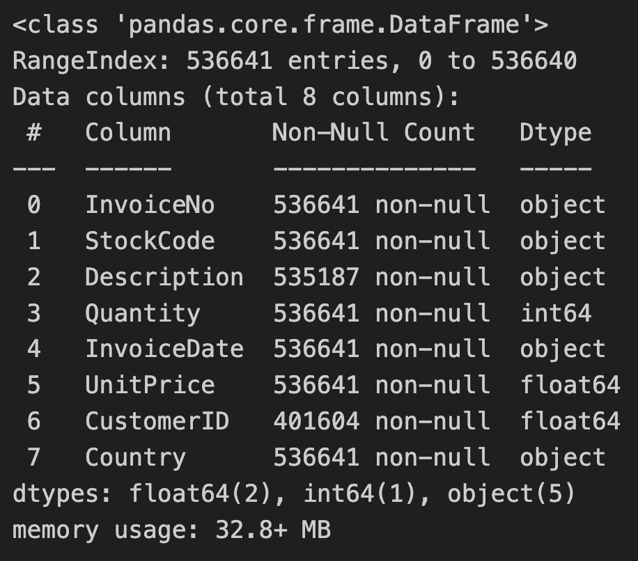

Analysis the customer action with RFM method.

#### Using language and Tools

Python, Pandas-profiling, Numpy, Pandas, SKlearn, Matplotlib

#### Goal of this project

The objective of this project is to analyze e-commerce customer action data and classify customers based on the characteristics identified in the data.

### <Text style="color:#008080">Dataset Description</Text>

This data is archived from this link
https://archive.ics.uci.edu/ml/datasets/online+retail

This is a transnational data set which contains all the transactions occurring between 01/12/2010 and 09/12/2011 for a UK-based and registered non-store online retail. The company mainly sells unique all-occasion gifts. Many customers of the company are wholesalers.

#### **data descriptions**

| Variable Name | Role     | Type         | Description                                                |
|---------------|----------|--------------|------------------------------------------------------------|
| InvoiceNo     | ID       | Categorical  | a 6-digit integral number uniquely assigned to each transaction. If this code starts with letter 'c', it indicates a cancellation |
| StockCode     | ID       | Categorical  | a 5-digit integral number uniquely assigned to each distinct product |
| Description   | Feature  | Categorical  | product name                                               |
| Quantity      | Feature  | Integer      | the quantities of each product (item) per transaction      |
| InvoiceDate   | Feature  | Date         | the day and time when each transaction was generated       |
| UnitPrice     | Feature  | Continuous   | product price per unit                                     |
| CustomerID    | Feature  | Categorical  | a 5-digit integral number uniquely assigned to each customer |
| Country       | Feature  | Categorical  | the name of the country where each customer resides         |

## <Text style="color:#50B1E4"> Data Rediness Check </Text>

1. Example data
   ```
   df = pd.read_csv("/Data/data.csv", encoding='unicode_escape')
   df.head()
   ```


  


1.  Duplicated Data Check
```
print("Duplicated value :", len(df[df.duplicated()]))
```

Duplicated value : 5268

```
df = df.drop_duplicates().reset_index(drop=True)
print("After drop, Duplicated value :", len(df[df.duplicated()]))
```
After drop, Duplicated value : 0

2.  EDA of the dataset

  

  CustomerID should be cast to Object.

```
list_cast_to_object = ["CustomerID"]
for column_name in list_cast_to_object:
  df[column_name] = df[column_name].astype(object)
  ```


3.  Devide the dataset into numeric data and categorical data.

```
list_categorical_columns = list(df.select_dtypes(include=['object']).columns)
list_numeric_columns = list(df.select_dtypes(include=['float64','int64']).columns)
print("Length of data: ",len(df))
print("Length of columns: ",len(df.columns))
print("categorical columns:",len(list_categorical_columns))
print("numerical columns:",len(list_numeric_columns))
```
  

4. Remove the useless column

Description column isn't used in this analysis. To prevent memory leakage, I remove the "description" column.
```
df = df.drop(["Description"], axis=1)
list_categorical_columns.remove("Description")
```


## <Text style="color:#50B1E4"> Feature Engineering</Text>

I'm writing this part


## <Text style="color:#008080"> Conclusion</Text>

I'm writing this part