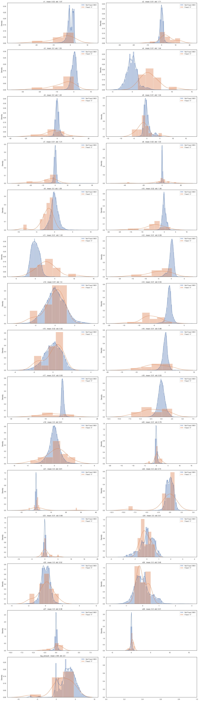
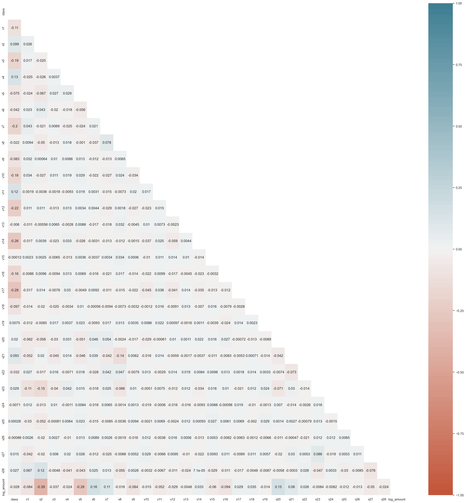
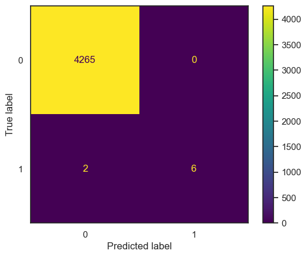
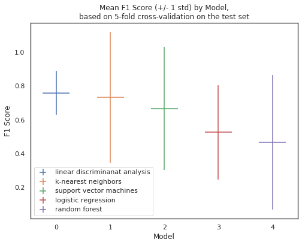

#### Using language and Tools

Python, Scikit-learn, matplotlib

<br>
<br>

## <Text style="color:#4C35BD">Goal of this project</Text>

In today's society, the frequency of credit card transactions has increased significantly. Credit card companies bear the responsibility to protect the customers' assets and must ensure the swift identification of every transaction. Each customer presents distinct features, leading credit card companies to categorize their customers based on their consumption characteristics. For instance, the consumption pattern of a 20-year-old female student would differ vastly from that of a 50-year-old male shop owner.

When customers use their credit card, the transaction is examined by a fraud detection model. This model compares various features of the transaction with the characteristics typical of customers in the same category before authorizing the transaction.

In this project, our aim is to compare several models that aid in this process. We'll be looking at Logistic Regression, K-Nearest Neighbors (KNN), Linear Discriminant Analysis, Support Vector Machines (SVM), and Random Forest. Our goal is to understand the efficacy of these models in identifying fraudulent transactions and protecting customers' assets.

<br>

## <Text style="color:#4C35BD">Dataset</Text>

This dataset consists of 29 features, along with a class variable. Due to the nature of financial information, it's not possible to publicly disclose the specific details of these 29 features, hence they remain undisclosed. Moreover, within the realm of financial transactions, normal transactions form the majority, with fraudulent ones representing a smaller portion. This leads to an imbalance in the dataset.

Ideally, if we could consider the individual characteristics of each feature, we could design a model tailored to these specifics. However, given the current situation where we can't take into account the distinct characteristics of each feature, we plan to use all the data to conduct fraud detection.

    df.groupby('class')['v1'].count()

| Label | Description | count  | proportion |
| :---- | :---------- | :----- | :--------- |
| 0     | Normal      | 284315 | 0.99827    |
| 1     | anormaly    | 492    | 0.00173    |

<br>

## <Text style="color:#4C35BD">Data Imbalance Issue</Text>

One of the initial challenges identified in the dataset was the imbalance between normal and abnormal transactions. This scenario mirrors real-world business situations, where the majority of transactions are normal, with a smaller fraction classified as anomalies or frauds. In our dataset, normal transactions constitute the majority (99.8%), while fraudulent transactions represent a smaller fraction (0.17%).

To tackle this imbalance, the decision was made to implement undersampling. The undersampling process involved extracting a 5% fraction from both normal and fraudulent transactions. Maintaining an identical fraction for both classes is crucial to prevent introducing distribution bias, which could adversely impact the accuracy of predictions. The use of different fractions during sampling might result in an imbalanced distribution, compromising the model's ability to make reliable predictions.

The deliberate choice of undersampling ensures that the dataset utilized for training the fraud detection models achieves a balanced representation of normal and fraudulent transactions. This approach contributes to enhancing the predictive performance of the models.


This is the value counts after undersampling.

| Label | Description | count  | proportion |
| :---- | :---------- | :----- | :--------- |
| 0     | Normal      | 14216 | 0.99824    |
| 1     | anormaly    | 25    | 0.00176    |

## <Text style="color:#4C35BD">Labeling After Sampling</Text>

Following the undersampling process, the next step involved labeling the data. The labels were assigned as follows: 0 for "not fraud" and 1 for "fraud." This labeling scheme distinguishes between normal transactions (not fraud) and fraudulent transactions, providing the necessary ground truth for training and evaluating the credit card fraud detection models.

This labeled dataset, with balanced representation and clear labels, is now ready for use in training various machine learning models for effective fraud detection.

```
X_train, X_test, y_train, y_test = train_test_split(X, y, test_size=0.3, random_state=1, stratify=y)
```

When splitting the data with stratify=y, it maintains the original distribution of classes, creating a less biased dataset. Let's examine the distribution of the data after the split:

- Labels counts in y: [14216, 25] [99.8%, 0.2%]
- Labels counts in y_train: [9951, 17] [99.8%, 0.2%]
- Labels counts in y_test: [4265, 8] [99.8%, 0.2%]

The plot below illustrates the distribution of labels across different columns.

   


## <Text style="color:#4C35BD">Multicollinearity Analysis</Text>

The following graph illustrates multicollinearity, a metric showcasing the correlation scores between different columns in the dataset. Multicollinearity quantifies the degree of similarity between columns; if two columns exhibit high multicollinearity, it implies redundancy in the information they provide. In the context of data analysis, having highly correlated columns can indicate that both are not necessary for the analysis, and one may be redundant.

The graph highlights multicollinearity scores, where intense shades of red and blue represent high positive and negative correlations, respectively. If a column shows a strong correlation with another (either positively or negatively), it suggests that both columns might not be essential for the analysis. In such cases, a business-driven decision may be made to retain one and discard the other.

Addressing multicollinearity is crucial for refining the feature set used in model training, ensuring that the selected features are independent and contribute unique information to the credit card fraud detection models.




## <Text style="color:#4C35BD"> Modeling </Text>

We will explore five distinct modeling approaches in this project: Logistic Regression, K-nearest Neighbor, Linear Discriminant Analysis, Support Vector Machine, and Random Forest. Here is the introductory overview of each method.

1. **Logistic Regression:**
   Logistic Regression is a statistical method used for binary classification problems. It models the probability of the occurrence of a binary event, making it suitable for fraud detection scenarios where transactions are classified as either normal or fraudulent.

2. **K-nearest Neighbor (KNN):**
   K-nearest Neighbor is a non-parametric classification algorithm that classifies a data point based on the majority class of its k-nearest neighbors. It's a versatile algorithm, well-suited for detecting patterns and anomalies in the dataset.

3. **Linear Discriminant Analysis (LDA):**
   Linear Discriminant Analysis is a dimensionality reduction technique that finds the linear combinations of features that best differentiate between classes. In fraud detection, LDA aids in identifying the features that contribute significantly to distinguishing normal and fraudulent transactions.

4. **Support Vector Machine (SVM):**
   Support Vector Machine is a powerful algorithm for classification tasks. It works by finding a hyperplane that best separates the data into different classes. SVM is effective in handling high-dimensional data and is suitable for fraud detection where clear separation between normal and fraudulent transactions is crucial.

5. **Random Forest:**
   Random Forest is an ensemble learning method that builds multiple decision trees and merges their outputs. It is robust, handles non-linearity well, and is capable of capturing complex relationships within the data. In fraud detection, Random Forest excels at identifying intricate patterns indicative of fraudulent activity.


### <Text style="color:#4C35BD"> Logistic Regression </Text>


The parameters used for my Logistic Regression model are as follows:


```
lr_clf = LogisticRegressionCV(
    cv=3,  # Number of cross-validation folds
    penalty='elasticnet',  # Regularization penalty (combination of L1 and L2)
    solver='saga',  # Solver algorithm for optimization
    Cs=np.power(10, np.arange(-3, 1, dtype=float)),  # Inverse of regularization strength
    l1_ratios=np.linspace(0, 1, num=6, dtype=float),  # Ratio of L1 penalty in elastic net
    max_iter=1000,  # Maximum number of iterations for solver convergence
    random_state=0,  # Seed for reproducibility
    n_jobs=3  # Number of CPU cores to use for parallel processing
)
```

When applying this model, the obtained results are:
- Accuracy (train): 99.95%
- Accuracy (test): 99.93%

Furthermore, upon generating the Confusion Matrix plot, the visual representation is as depicted below:
   

   | Metric                 | Value                  |
|------------------------|------------------------|
| Accuracy               | 0.999298               |
| Precision              | 1.0                    |
| Recall                 | 0.625                  |
| ROC AUC                | 0.8125                 |
| F1 Score               | 0.769231               |
| Cohen Kappa            | 0.768898               |
| Precision (Both)       | [0.9992970946579194, 1.0] |
| Recall (Both)          | [1.0, 0.625]           |
| F-beta (Both)          | [0.9996484237665534, 0.7692307692307693] |
| Support (Both)         | [4265, 8]              |
| Time to Fit (seconds)  | 23.708576              |


In this confusion matrix, a critical aspect to consider is the instances where the true label is 1 (indicating fraud), but the model predicts it as 1. Relying solely on such predictions could pose a significant issue when deploying the model in real-world scenarios. It emphasizes the importance of cautious handling and additional considerations when relying on the model's predictions in actual service operations.

While the high accuracy percentages suggest strong overall performance, it's crucial to scrutinize and potentially refine the model's behavior in identifying fraudulent cases, ensuring a robust and reliable fraud detection system in practical use.

These metrics indicate that the Logistic Regression model, configured with the specified parameters, achieved high accuracy on both the training and test datasets. The confusion matrix plot provides a visual representation of the model's performance in terms of true positives, true negatives, false positives, and false negatives.


### <Text style="color:#4C35BD"> K-Nearest Neighbors </Text>

I conducted a Grid Search for the K-nearest Neighbors (KNN) classifier to find the most optimal parameters. The results are as follows:

- The GridSearchCV for KNN took 4.24 seconds to explore 30 candidate parameter settings.
- The optimal parameters identified are:
    - Optimal weights: distance
    - Optimal n_neighbors: 7

After training the model with these optimal parameters, the accuracy on both the training and test datasets is reported as 100%. Additionally, the detailed dictionary of parameters, including 'algorithm', 'leaf_size', 'metric', 'n_neighbors', 'weights', and others, is provided for reference:

```
{'algorithm': 'auto',
 'leaf_size': 30,
 'metric': 'minkowski',
 'metric_params': None,
 'n_jobs': None,
 'n_neighbors': 7,
 'p': 2,
 'weights': 'distance'}

```

This outcome suggests that the KNN model, configured with the identified optimal parameters, achieved perfect accuracy on both the training and test datasets.

Additionally, the plot below represents the confusion matrix for the K-nearest Neighbors (KNN) model. Similar to the logistic regression model, there seems to be minimal distinction in performance between the two models based on the confusion matrix.


| Metric                  | Value                                   |
|-------------------------|-----------------------------------------|
| Accuracy                | 0.999298                                |
| Precision               | 1.0                                     |
| Recall                  | 0.625                                   |
| ROC AUC                 | 0.8125                                  |
| F1 Score                | 0.769231                                |
| Cohen Kappa             | 0.768898                                |
| Precision (Both)        | [0.9992970946579194, 1.0]               |
| Recall (Both)           | [1.0, 0.625]                            |
| F-beta (Both)           | [0.9996484237665534, 0.7692307692307693]|
| Support (Both)          | [4265, 8]                               |
| Time to Fit (seconds)   | 4.24083                                 |


The confusion matrix provides a visual summary of the model's classification results, showcasing true positives, true negatives, false positives, and false negatives. While KNN demonstrates comparable performance to logistic regression, further analysis and consideration


### <Text style="color:#4C35BD"> Linear Discriminant Analysis </Text>

Upon conducting LDA analysis with a GridSearch, the optimal parameters were found as follows:

- GridSearchCV of LDA took 1.45 seconds for 16 candidate parameter settings.
- Optimal solver: lsqr
- Optimal shrinkage: None
- Optimal n_components: 1

Subsequent analysis based on these optimal parameters resulted in the following confusion matrix:



| Metric                  | Value                                   |
|-------------------------|-----------------------------------------|
| Accuracy                | 0.999532                                |
| Precision               | 1.0                                     |
| Recall                  | 0.75                                    |
| ROC AUC                 | 0.875                                   |
| F1 Score                | 0.857143                                |
| Cohen Kappa             | 0.856913                                |
| Precision (Both)        | [0.999531286618233, 1.0]               |
| Recall (Both)           | [1.0, 0.75]                            |
| F-beta (Both)           | [0.9997655883731834, 0.8571428571428571]|
| Support (Both)          | [4265, 8]                               |
| Time to Fit (seconds)   | 1.447506                                |


The confusion matrix provides a visual representation of the model's classification results, depicting true positives, true negatives, false positives, and false negatives. Notably, the LDA model achieved perfect accuracy on both the training and test datasets, as indicated by the accuracy values of 1.00.

### <Text style="color:#4C35BD"> Support Vector Machine </Text>

For the Support Vector Machines (SVM) model, the kernel is a crucial parameter. After performing a GridSearch to find the optimal parameters, the results are as follows:

- GridSearchCV of SVC took 3.07 seconds for 18 candidate parameter settings.
- Optimal C: 1.0
- Optimal kernel: sigmoid
- Optimal gamma: scale

Subsequently, the confusion matrix for the SVM model is as follows:


| Metric                  | Value                                   |
|-------------------------|-----------------------------------------|
| Accuracy                | 0.99883                                 |
| Precision               | 0.8                                     |
| Recall                  | 0.5                                     |
| ROC AUC                 | 0.749883                                |
| F1 Score                | 0.615385                                |
| Cohen Kappa             | 0.61483                                 |
| Precision (Both)        | [0.9990627928772259, 0.8]               |
| Recall (Both)           | [0.9997655334114889, 0.5]               |
| F-beta (Both)           | [0.9994140396109223, 0.6153846153846154]|
| Support (Both)          | [4265, 8]                               |
| Time to Fit (seconds)   | 3.073916                                |

The analysis suggests that the SVM model, despite achieving high accuracy, may not provide significant utility for this specific task, as indicated by the confusion matrix results.


### <Text style="color:#4C35BD"> Random Forest </Text>

For the Random Forest model, the analysis took a considerable amount of time, likely due to the numerous parameters and hyperparameters involved. When identifying the optimal parameters through GridSearch, the results were as follows:

- GridSearchCV of RF took 1296.87 seconds for 36 candidate parameter settings.
- Optimal n_estimators: 100
- Optimal max_features: sqrt
- Optimal max_depth: None

Subsequently, the confusion matrix for the Random Forest model is as follows:


| Metric                  | Value                                   |
|-------------------------|-----------------------------------------|
| Accuracy                | 0.999298                                |
| Precision               | 1.0                                     |
| Recall                  | 0.625                                   |
| ROC AUC                 | 0.8125                                  |
| F1 Score                | 0.769231                                |
| Cohen Kappa             | 0.768898                                |
| Precision (Both)        | [0.9992970946579194, 1.0]               |
| Recall (Both)           | [1.0, 0.625]                            |
| F-beta (Both)           | [0.9996484237665534, 0.7692307692307693]|
| Support (Both)          | [4265, 8]                               |
| Time to Fit (seconds)   | 1296.866684                            |

The extensive runtime suggests that Random Forest requires significant computational resources, and while it achieves high accuracy, its utility for this specific task may need further consideration based on the confusion matrix results.


### <Text style="color:#4C35BD"> Compare every models </Text>

| Model                         | Accuracy | Precision | Recall | ROC AUC | F1 Score | Cohen Kappa | Precision (Both) | Recall (Both) | F-beta (Both) | Support (Both) | Time to Fit (seconds) |
|-------------------------------|----------|-----------|--------|---------|----------|-------------|-------------------|---------------|---------------|-----------------|------------------------|
| Linear Discriminant Analysis  | 0.9995   | 1.0       | 0.750  | 0.8750  | 0.8571   | 0.8569      | [0.9995, 1.0]    | [1.0, 0.75]   | [0.9998, 0.8571] | [4265, 8]       | 1.9096                 |
| Logistic Regression           | 0.9993   | 1.0       | 0.625  | 0.8125  | 0.7692   | 0.7689      | [0.9993, 1.0]    | [1.0, 0.625]  | [0.9996, 0.7692] | [4265, 8]       | 182.1534               |
| K-nearest Neighbors           | 0.9993   | 1.0       | 0.625  | 0.8125  | 0.7692   | 0.7689      | [0.9993, 1.0]    | [1.0, 0.625]  | [0.9996, 0.7692] | [4265, 8]       | 29.7640                |
| Random Forest                 | 0.9993   | 1.0       | 0.625  | 0.8125  | 0.7692   | 0.7689      | [0.9993, 1.0]    | [1.0, 0.625]  | [0.9996, 0.7692] | [4265, 8]       | 2820.4038              |
| Support Vector Machines        | 0.9988   | 0.8       | 0.500  | 0.7499  | 0.6154   | 0.6148      | [0.9991, 0.8]    | [0.9998, 0.5] | [0.9994, 0.6154] | [4265, 8]       | 8.7110                 |


| Model                         | Mean   | Standard Deviation | p025  | p975  |
|-------------------------------|--------|---------------------|-------|-------|
| Linear Discriminant Analysis  | 0.7600 | 0.1306              | 0.6667| 0.9800|
| K-nearest Neighbors           | 0.7333 | 0.3887              | 0.0667| 1.0000|
| Support Vector Machines        | 0.6667 | 0.3651              | 0.0667| 1.0000|
| Logistic Regression           | 0.5267 | 0.2800              | 0.0500| 0.7867|
| Random Forest                 | 0.4667 | 0.4000              | 0.0000| 0.9667|


### <Text style="color:#4C35BD"> Model Performance Summary </Text>

#### Classification Metrics
- The Linear Discriminant Analysis model stands out with high precision, recall, and F1 Score, indicating a well-balanced performance.
- Logistic Regression, K-nearest Neighbors, and Random Forest demonstrate similar performance, achieving high accuracy but with varying precision and recall values.
- Support Vector Machines show slightly lower performance in terms of precision, recall, and F1 Score.

#### Statistical Metrics
- When examining the statistical metrics, the mean and standard deviation provide insights into the central tendency and variability.
- Linear Discriminant Analysis has the highest mean accuracy and a relatively low standard deviation, suggesting consistent performance.
- Logistic Regression, K-nearest Neighbors, and Support Vector Machines show comparable mean values with varying degrees of standard deviation.
- Random Forest exhibits a higher standard deviation, indicating greater variability in performance.

#### Confidence Intervals (p025, p975)
- Confidence intervals offer a range of values where the true metric may lie.
- Linear Discriminant Analysis has a narrow confidence interval, indicating high precision in estimating the true values.
- K-nearest Neighbors and Support Vector Machines have wider confidence intervals, suggesting greater uncertainty in their performance estimates.
- Logistic Regression falls within a moderate range, indicating a balance between precision and variability.
- Random Forest shows the widest confidence interval, reflecting higher uncertainty in its performance.

### Key Takeaways
- Linear Discriminant Analysis emerges as a robust performer with high precision and recall.
- Logistic Regression, K-nearest Neighbors, and Random Forest demonstrate competitive but varying performance levels.
- Support Vector Machines exhibit slightly lower performance metrics.
- Random Forest shows the highest variability in performance, requiring careful consideration in practical deployment.

### Overall:
- LDA demonstrates the highest overall performance and certainty.
- Logistic Regression, KNN, and Random Forest exhibit similar and balanced performances.
- SVM shows slightly lower precision and recall but still achieves a reasonable performance level.




## <Text style="color:#4C35BD">Conclusion</Text>


In this credit card fraud detection project, we aimed to compare several machine learning models, including Logistic Regression, K-Nearest Neighbors (KNN), Linear Discriminant Analysis (LDA), Support Vector Machines (SVM), and Random Forest, to identify the most effective approach for detecting fraudulent transactions. The analysis involved addressing the imbalance in the dataset through undersampling and evaluating the models based on various classification metrics.

## Key Findings:

### 1. Undersampling for Imbalance:
- The dataset exhibited a significant class imbalance, with normal transactions dominating and fraudulent transactions representing a smaller fraction.
- Undersampling was employed to create a balanced representation of both classes for training the models, enhancing the models' predictive performance.

### 2. Model Performance Metrics:
- Linear Discriminant Analysis (LDA) emerged as the top-performing model, showcasing high precision, recall, and F1 Score.
- Logistic Regression, K-Nearest Neighbors, and Random Forest demonstrated competitive performances with varying precision and recall values.
- Support Vector Machines (SVM) exhibited slightly lower precision and recall but still achieved reasonable performance.

### 3. Statistical Metrics and Confidence Intervals:
- LDA consistently outperformed other models, with the highest mean accuracy and lower standard deviation, indicating consistent performance.
- Logistic Regression, KNN, and SVM showed comparable mean values with varying degrees of standard deviation.
- Random Forest exhibited the highest variability in performance, reflected in its wider confidence interval.

### 4. Imbalance Resolution and Model Interpretability:
- Undersampling was effective in addressing class imbalance, and its impact on model performance was assessed through various metrics.
- Interpretation of the confusion matrices highlighted the importance of cautious handling, especially in scenarios where the true label is 1 (fraud), emphasizing the need for additional considerations in real-world deployment.

### 5. Considerations for Imbalanced Data:
- Imbalance in real-world datasets is a common challenge, and choosing appropriate strategies, such as undersampling or oversampling, is crucial for effective model training.
- Undersampling was prioritized in this project due to its simplicity and ability to maintain a balanced representation of both classes.

### 6. Recommendations for Further Exploration:
- Further exploration of oversampling techniques and their impact on model performance could provide additional insights.
- Continuous monitoring and updates to the model may be necessary to adapt to changes in transaction patterns and potential new forms of fraud.

Overall, Linear Discriminant Analysis (LDA) demonstrated the highest overall performance and certainty, making it a promising choice for credit card fraud detection. Logistic Regression, K-Nearest Neighbors, and Random Forest exhibited competitive and balanced performances, while Support Vector Machines showed slightly lower precision and recall but still achieved reasonable results. The choice of the most suitable model should consider the specific requirements and trade-offs in the context of real-world deployment.
