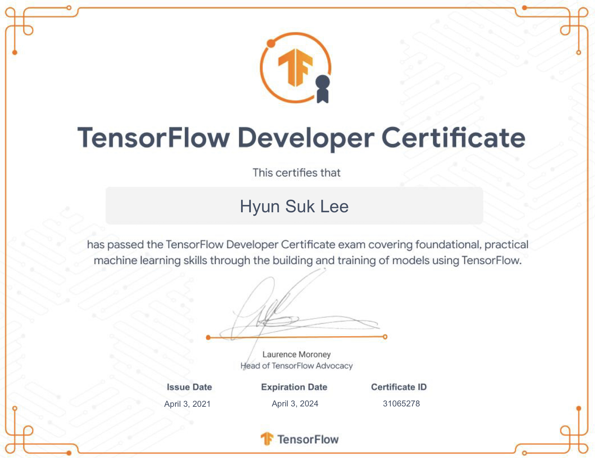

---

## Contact

---

- [Blog](https://nockda.github.io)
- [GitHub @Nockda](https://github.com/nockda)
- [LinkedIn](https://www.linkedin.com/in/nockda/)
- [CV](https://drive.google.com/file/d/1B1EeJuFX6bwUstTbmsuILSCS5UyWlT3M/view?usp=share_link?raw=True)
- <nockda@gmail.com>

 

---

## Visa Status in UK

---

- _**Tier 4 visa**_ until Jan, 2024
- after that, _**PSW visa**_ for 2 years
- **<Text style="color:red"> Don't need the visa support</Text>**

 

---

## Career

---

- [MICUBE Solution](https://www.micube.co.kr/en/), Mid-level developer
- [Taekwang](https://tkg.taekwang.com/en/index.do), Project leader

 

---

## CS Language and tools

---

- Python / Java / C#
- MySQL / Oracle SQL
- Django, Rest API, Chakra UI, OSGI
- **Big Data /** Hadoop, Spark
- **NLP /** Spacy, NLTK, Re
- **Data Science /** Pandas, Numpy, Matplotlib, Seaborn
- **Machine Learning /** scikit-learn
- **Deep Learning /** TensorFlow, Keras, PyTorch
- **CI.CD /** Git, GitHub

 

---

## Education

---

- University of Glasgow / MSc in Data Science
- Korea National Open University / Computer Science
- Ajou University / Business Administration
- Seoul Institute of the Art / Film

   

---

### Other Training

---

- Big data analysis by using Python and R
- GYBM(Global Young Business Manager) 5th

 
 
---

## Certificate

---

 

- [TensorFlow Developers Certificate](https://www.credential.net/f77748c3-e10c-41c8-ac6c-79a1a6c36ac4#gs.z83vau)

 

---

## Language

---

- Korean (Native)
- English (Fluent)
- Vietnames (Fluent)

---
