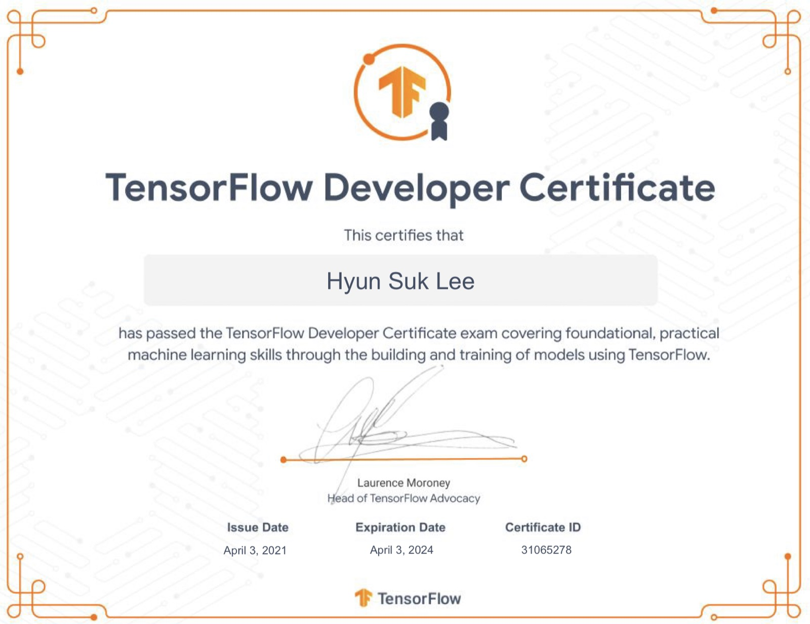

I'm an AI Engineer with 10 years across manufacturing, FMCG and enterprise IT,
spanning software engineering, enterprise architecture and data engineering. I
build production RAG and agentic LLM systems and take them from prototype
through to live service.

Based in London / Essex, UK, and relocatable. I hold a **UK Global Talent Visa**,
so I need no visa sponsorship.

---

## Contact

- [GitHub @Nockda](https://github.com/nockda)
- [LinkedIn](https://www.linkedin.com/in/nockda/)
- [CV](https://drive.google.com/file/d/1jYvL7nwTGp2wPTMpEn_hLCQO8aIUKytj/view?usp=share_link)
- [nockda@gmail.com](mailto:nockda@gmail.com)

---

## Experience

#### AI Consultant, LLM Engineering &mdash; Samsung SDS Europe, London
*May 2026 &ndash; Present*

- Define enterprise AI architecture and technical direction, setting how GenAI
  services are designed, evaluated and deployed across CRM, e-commerce and
  marketing platforms.
- Built the core RAG service on on-premise GPUs — a fine-tuned, 4-bit quantised
  open-weight model with Elasticsearch hybrid search (BM25 + vector KNN).
  **Resolution time down 40%.**
- Added agentic tool calling for multi-step queries, with evaluation and
  monitoring in place before release: hallucination rate, retrieval precision,
  A/B tests.
- Connected AI services to enterprise systems through MCP and internal APIs,
  giving agents controlled access to CRM and operational data.

*Python · LLM · LangGraph · MCP · RAG · Elasticsearch · APIs · Cloud · LLMOps · CI/CD · SQL*

#### Enterprise System Specialist / Data Engineer &mdash; Gerald McDonald, Essex
*April 2024 &ndash; April 2026*

- Built a RAG/LLM service from prototype to production as sole engineer.
  **Adopted by 50+ business users.**
- AWS Glue ETL into a Snowflake data warehouse, hybrid retrieval via LangChain,
  Streamlit front end. Also owned the security review and permission model.
- Added document-processing workflows with tool calling for structured outputs.
  **Manual review time down 60%.**
- LLMOps: prompt versioning, precision@k monitoring, regression tests in CI/CD.
- Led the Dynamics 365 ERP/CRM migration, designing the hybrid on-premise and
  cloud architecture.

*Python · LangChain · RAG · AWS (Glue, S3) · Snowflake · Dynamics 365 · LLMOps · CI/CD · Kubernetes*

#### Software Engineer, DevOps & Big Data &mdash; MICUBE Solution, Seoul
*September 2021 &ndash; July 2022*

- Kafka and Spark pipelines processing sensor data from factory production
  equipment.
- Anomaly detection models flagging equipment faults before failure, cutting
  error rates and unplanned downtime.
- Backend services in Java and C#, SQL tuning, and DevOps tooling on Airflow
  and Kubernetes.

*Python · Java · C# · SQL · Kafka · Spark · Airflow · Kubernetes · Anomaly detection*

#### Business Analyst / Project Leader &mdash; Taekwang, Gimhae
*June 2016 &ndash; August 2020*

- Led a **£4M MES/SCM programme** across multiple manufacturing sites.
- Redesigned planning and logistics processes for a **25% efficiency gain**.
- Oracle data models, PL/SQL, KPI dashboards and QA audits.

*Oracle · PL/SQL · MES · SCM · Business process analysis*

---

## Skills

**Generative AI & LLM engineering** — RAG architecture · vector databases and
hybrid search (BM25 + vector KNN) · agentic workflows and tool calling ·
LangChain · LangGraph · MCP · LLM fine-tuning · prompt engineering

**MLOps & data engineering** — LLMOps · evaluation frameworks (hallucination
rate, precision@k) · model registry · A/B testing · CI/CD · monitoring · AWS
(Glue, S3, SageMaker) · Azure · Snowflake · Kafka · Spark · Airflow · Terraform ·
ETL/ELT · data warehousing

**Machine learning & analytics** — PyTorch · TensorFlow · scikit-learn ·
anomaly detection · churn modelling

**Software engineering & architecture** — System design · APIs and microservices ·
distributed systems · enterprise integration (ERP/CRM) · hybrid cloud
architecture · PoC-to-production ownership · stakeholder engagement · Agile ·
PRINCE2

**Languages & platforms** — Python · SQL · Java · C# · Go · TypeScript · Docker ·
Kubernetes · Git · Dynamics 365

---

## Education

- **MSc Data Science** — University of Glasgow, UK (2022 &ndash; 2023)
- **BSc Computer Science** — Korea National Open University (2020 &ndash; 2022)
- **BBA Business Administration** — Ajou University, Korea (2013 &ndash; 2015)
- Seoul Institute of the Arts — Film

#### Other training

- Big data analysis with Python and R
- GYBM (Global Young Business Manager), 5th cohort

---

## Certifications

- Microsoft Certified: Azure Data Engineer Associate (DP-203)
- Microsoft Certified: Power BI Data Analyst Associate (PL-300)
- PRINCE2 Foundation
- [TensorFlow Developer Certificate](https://www.credential.net/f77748c3-e10c-41c8-ac6c-79a1a6c36ac4#gs.z83vau)

---

## Languages

- Korean (native)
- English (fluent)
- Vietnamese (fluent)
